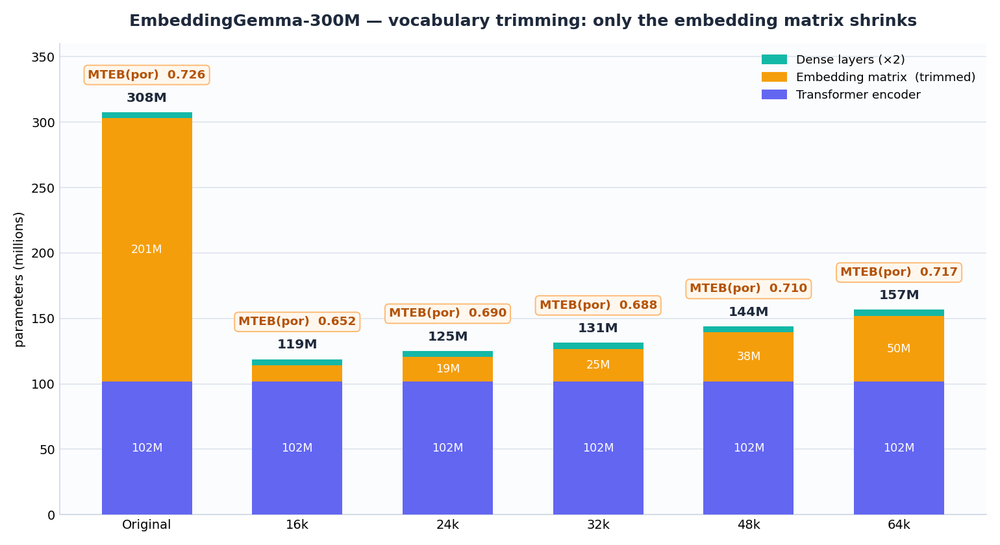
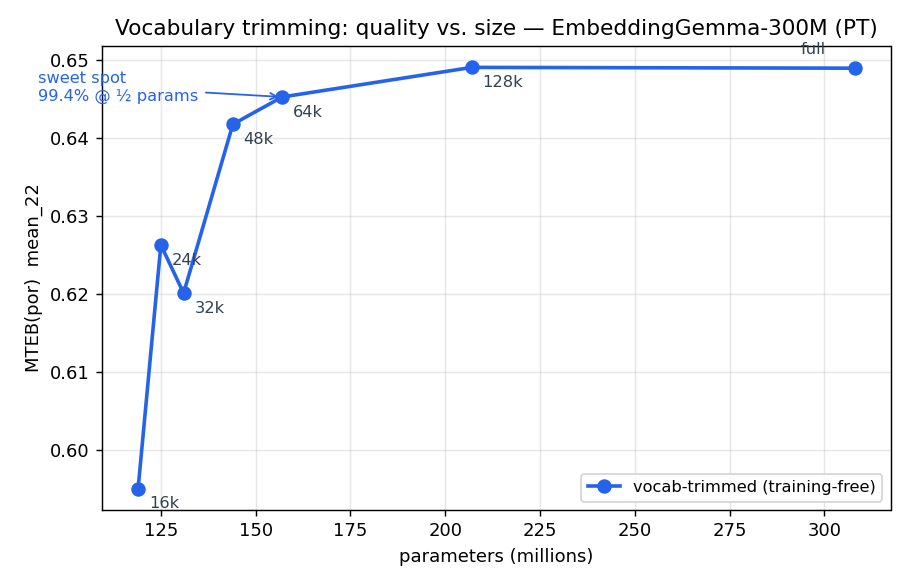

# embedding-vocab-trimmer

**Shrink a multilingual text-embedding model to a single language — no training, no GPU — by trimming its token vocabulary.**

A multilingual embedding model keeps most of its parameters in the token-embedding matrix
(EmbeddingGemma-300M: `262144 × 768 ≈ 201M` of its `~308M` params). If you only serve **one**
language, the other languages' embeddings are dead weight. `trim_vocab.py` mines which tokens
your language actually uses, keeps the top-K, re-indexes the embedding matrix, and rewrites the
BPE merge table — pure matrix surgery that leaves the transformer encoder and the
SentenceTransformers pooling/Dense heads **bit-for-bit unchanged**.

> **Result on Portuguese (EmbeddingGemma-300M → 157M):** the 64k-vocab trim keeps **98.8%** of
> the full model's MTEB(por) score at **~half the parameters** — *with zero training*.

📦 Example model: **[`tardellirs/embeddinggemma-pt-br`](https://huggingface.co/tardellirs/embeddinggemma-pt-br)** · 🛠️ Tool: [github.com/tardellirs/embedding-vocab-trimmer](https://github.com/tardellirs/embedding-vocab-trimmer)



---

## How it works

```
multilingual model                         language-trimmed model
┌───────────────────────────┐              ┌───────────────────────┐
│ embed_tokens  262144×768  │  ── trim ──▶ │ embed_tokens 64000×768 │   ← only this shrinks
├───────────────────────────┤              ├───────────────────────┤
│ transformer encoder       │  (unchanged) │ transformer encoder    │
│ pooling + Dense heads     │  (unchanged) │ pooling + Dense heads  │
└───────────────────────────┘              └───────────────────────┘
        ~308M params                                ~157M params
```

1. **Mine token frequencies** — tokenize a large sample of target-language text and count token ids.
2. **Keep top-K + specials** — keep the most frequent K tokens plus the functional special tokens
   (pad / bos / eos / unk and frequent whitespace), drop the rest. Re-index to a contiguous `0..K-1`.
3. **Filter the BPE merges** — this is the step everyone gets wrong: a merge rule `A B → AB` is only
   valid if **A, B *and* AB all survive** the trim. Drop any merge that references a deleted token,
   or the tokenizer can emit an id you removed.
4. **Slice the embedding matrix** — copy the kept rows of `embed_tokens.weight` into a new `K×d`
   matrix, update `config.vocab_size`, and reattach the original encoder + pooling/Dense heads.

No weights are trained. The whole thing runs on a CPU in a few minutes.

## Install

```bash
pip install -r requirements.txt
```

## Quickstart

```bash
# trim EmbeddingGemma-300M to a 64k Portuguese vocabulary
python trim_vocab.py \
    --model google/embeddinggemma-300m \
    --corpus-config por \
    --vocab-size 64000 \
    --output ./embeddinggemma-pt-br

# (optional) upload to the Hub — needs HF_TOKEN in your environment
python trim_vocab.py --model google/embeddinggemma-300m --corpus-config por \
    --vocab-size 64000 --output ./out --push <user>/embeddinggemma-pt-br
```

`--corpus-config` is the language code of the mining corpus (defaults to the
[`lbourdois/fineweb-2-trimming`](https://huggingface.co/datasets/lbourdois/fineweb-2-trimming) configs,
e.g. `por`, `fra`, `deu`, `spa`). Use `--corpus-dataset` to mine from any other text dataset.

## Results — Portuguese (EmbeddingGemma-300M)

Evaluated on **MTEB(por)** (16 headline tasks, `mean_16`). *Vocabulary size is the only lever — quality
recovers monotonically as you keep more tokens; **the encoder and Dense heads are identical at every size.***

| vocab | params | MTEB(por) `mean_16` | vs. full EG-300M |
|------:|-------:|:-------------------:|:----------------:|
| 16k   | ~119M  | 0.652  | −0.074 |
| 24k   | ~125M  | 0.6895 | −0.036 |
| 32k   | ~131M  | 0.6881 | −0.038 |
| 48k   | ~144M  | 0.7098 | −0.016 |
| **64k** | **~157M** | **0.7172** | **−0.0085** |
| *full EG-300M* | *~308M* | *0.7257* | *—* |

**64k is the sweet spot: ≈ full-model quality at half the parameters.** 24k is the smallest practical
point (smaller models lose fine retrieval quality fast). See [`results/`](results/) and the worked
example in [`examples/embeddinggemma_pt.md`](examples/embeddinggemma_pt.md).



## Scope & limitations

- **What it's for:** *compressing* a strong multilingual embedder to one language. It is a compression
  method, **not** an enhancement method — we separately tried light fine-tuning, layer/MLP pruning, and
  embedding-matching distillation from a larger teacher to push the trimmed model *past* its score, and
  **every weight-space change reduced MTEB(por)** (−0.02 to −0.04). The base model is at its
  representational ceiling; trimming shrinks it for free, but you can't squeeze more quality out of it.
- **Tokenizer:** BPE with `byte_fallback` (validated on the Gemma/EmbeddingGemma family). The method
  generalizes to other BPE/SentencePiece embedders; merge-filtering details may need tweaking per family.
- **Architecture:** SentenceTransformers models whose first module is a `transformers` encoder with an
  `embed_tokens` matrix (encoder + pooling + optional Dense heads are copied through untouched).

## License

Tool: **Apache-2.0** (see [`LICENSE`](LICENSE)). The example model is derived from Google's
EmbeddingGemma and is distributed under the **[Gemma license](https://ai.google.dev/gemma/terms)**
(see [`NOTICE`](NOTICE)). Trimmed models inherit the base model's license.

## Citation

If this is useful, a star or a link back is appreciated. Benchmark: MTEB(por) *(public release coming soon —
link to be added)*.
